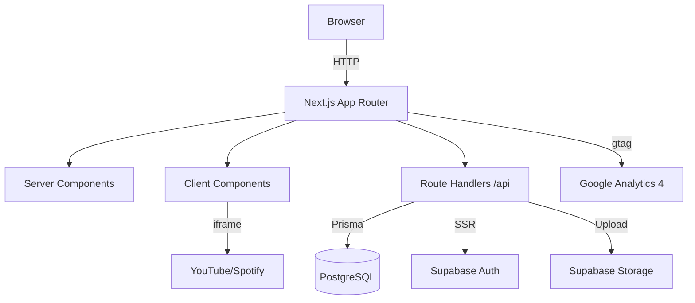

# Arquitetura — Reiners Media Podcast Studio

## 1. Stack
- **Frontend**: Next.js 14+ App Router, React Server Components
- **Styling**: Tailwind CSS + Design Tokens
- **Backend**: Next.js Route Handlers
- **ORM**: Prisma + Supabase PostgreSQL
- **Auth**: Supabase Auth (JWT)
- **Storage**: Supabase Storage
- **Deploy**: Vercel
- **Analytics**: GA4 + EventLog interno

## 2. Diagrama


## 3. Estrutura de Pastas
```
app/
├── (public)/          # Landing + Portfolio
│   ├── page.tsx
│   ├── portfolio/
│   └── programa/[slug]/
├── admin/             # Painel admin
│   ├── page.tsx
│   ├── programas/
│   ├── episodios/
│   └── analytics/
├── api/               # APIs REST
│   ├── podcasts/
│   ├── episodes/
│   ├── events/
│   └── upload/
components/
├── ui/                # Componentes base
├── layout/            # Navbar, Footer, Sidebar
├── sections/          # Seções da landing
├── portfolio/         # Grid, Posters, Expandable
└── admin/             # Forms, Dashboard
lib/
├── tokens.ts          # Design tokens
├── prisma.ts          # Singleton Prisma
├── supabase.ts        # Client SSR
├── schemas.ts         # Zod schemas
├── animations.ts      # Motion utilities
└── analytics.ts       # Event tracking
```

## 4. Decisões Técnicas
| Decisão | Contexto | Alternativas Rejeitadas |
|---------|----------|------------------------|
| Next.js App Router | SSR/ISR nativo | Remix (menos maduro) |
| Supabase | Auth+DB+Storage integrado | Firebase (lock-in) |
| Prisma | Type safety + migrations | Drizzle (menos maduro) |
| Tailwind | Utility-first rápido | Styled-components (overhead) |
| Route Handlers | Integração nativa Next.js | Express (overhead extra) |

## 5. Mapa de Ownership
| Arquivo | Owner |
|---------|-------|
| src/lib/tokens.ts | TCK-001 |
| prisma/schema.prisma | TCK-002 |
| src/lib/supabase.ts | TCK-004 |
| src/middleware.ts | TCK-004 |
| src/app/api/podcasts/* | TCK-005 |
| src/app/api/episodes/* | TCK-006 |
| src/components/ui/* | TCK-008 |
| src/components/layout/* | TCK-009 |
| src/app/(public)/page.tsx | TCK-011,012 |
| src/app/(public)/portfolio/* | TCK-013,014,015,016 |
| src/app/admin/* | TCK-017,018,019,020 |
